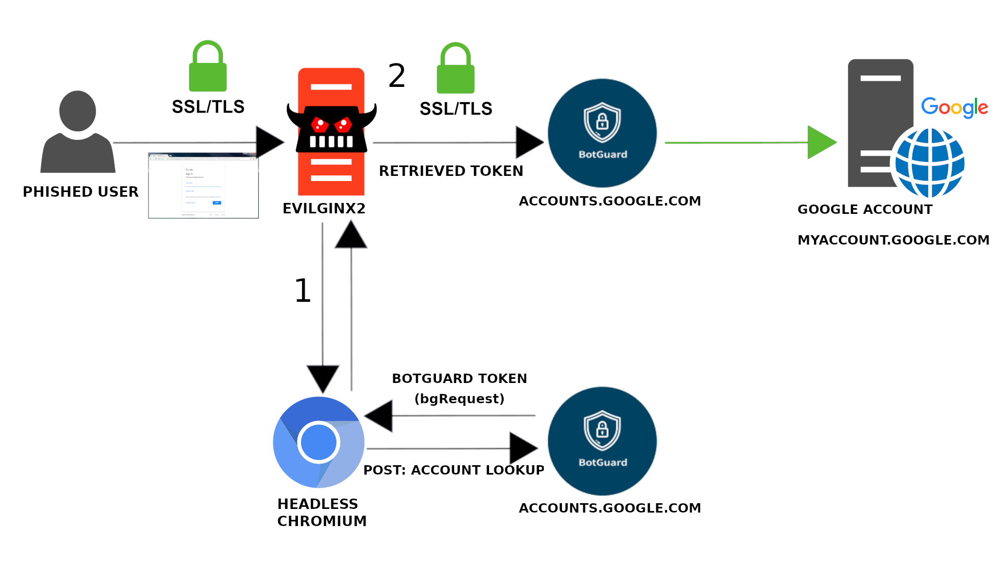

  
    
  
    
    

###### This repo will describe a method which allows you to successfully use MITM phishing tools (e.g. evilginx) on Google's login page without JS raising a fuss and [blocking login](https://i.stack.imgur.com/MnjWd.png).  Based on spoofing token value sent as `bgRequest` parameter 

#### Preambul

> 🚨 **Warning**  🚨
> 
>  This repo was created 2021 when the login page was still using the v2 login. Google did A/B testing throughout August 2022 and completely transitioned to the v3 login page as of September 2022. Information provided here may be outdated and incorrect.

> ⚠️ **PLEASE NOTE** ⚠️
> 
> This is NOT a generator for producing botguard tokens, nor a bypass mechanism to eliminate the botguard framework altogether. It is NOT an exploit. It's simply an outline of Google's anti-bot JavaScript system utilizing a token to authorize your request, delivered through a request parameter labeled `bgRequest`.

# Bypassing Google's Botguard Anti-Bot System 

### Why

The idea here presents a coarse workaround of using a headless browser to obtain a legitimate token. It can then be used instead of the failing one with any MITM phishing tool of your preference. Keep in mind that this is NOT a perfect solution, but a stopgap measure to avoid being blocked.
> 
> Required changes that had to be made to Google's login source code around 2019/20
>
> source: *THE UNEXPECTED PHISH* (Hack In The Box Security Conference 2019)

Back in February 2021, I intended to use evilginx2 to establish a phishing page for Google. Subsequently, I started investigating why the then-existing Google phishlets fail post submission of email and how to build a functioning phishlet.

Being relatively inexperienced in JavaScript analysis, I found myself extensively engrossed in attempting to understand the JavaScript execution flow. I eventually discovered that the Google login page wasn't functioning. 

Working extensively on this project, I set a personal goal to unravel why the Google login didn't operate as expected. Determined not to abandon projects as in my usual style when hurdles arise, I repeatedly replayed requests in burp; finally landing on a breakthrough when login unexpectedly ceased triggering the 'Couldn't sign you in' error, prompting me to password entry instead. 

My journey of trial and error eventually led to the incidental discovery of a solution–a mechanism to bypass Google's 'Couldn't Sign You In' error, using a headless browser. Despite it being resource-intensive and not viable for mass application in actual phishing campaigns, I consider it an important milestone in my development journey.

The ideal solution would still involve rewriting the check performed in JS that would then prevent the triggering of a 'rejected' response by botguard.

### How

Phishing page login success hinges on the submission of an authentic botguard token within the /accountLookup request. This parameter, bearing the botguard token, is identifiable by `bgRequest=` in the request parameters after email submission.

Obtaining a valid token involves generating one on the actual google.com page by trying to log in. Utilizing a headless browser, namely [go-rod](https://github.com/go-rod/rod), it's possible to visit accounts.google.com, enter the victim's email and retrieve the token from request parameters.

### Notes

The previously described method, while not speedy, illustrates the essence of the process in brute force. Although this method is initially slow, 2-4 seconds to activate the browser, I've sped up the process using a REST API to retrieve the token. 

Bear in mind that while it's not necessary to send out the headless browser's request since the botguard token is generated on the client-side via JS, hijacking and blocking the request is a must to avoid being throttled. 

The root cause of failure when using tools like evilging is the fact that the phishing page's domain is different from google.com. By utilizing google.com as your phishing domain and mapping google.com to localhost via the hosts' file, the login process on the phishing page won't be rejected due to botguard.

Google's botguard detects headless browser sessions. Avoid detection by using puppeteer's [stealth plugin](https://www.npmjs.com/package/puppeteer-extra-plugin-stealth) or, in the case of go-rod, use the [go-rod/stealth](https://github.com/go-rod/stealth) package.

Evolution in Google's headless browser detection measures may need more evasion methods in time.

### Get in touch

As a seasoned developer with a profound interest in phishing techniques - both with and without the usage of Man-in-the-Middle (MITM) tools - I am forever on the lookout for fresh challenges and opportunities for growth. 

Your opinions and expertise matter. Whether you wish to proffer your thanks, indicate any inaccuracies, or just have an enriching, tech-charged conversation, I welcome it all.

**Don't hesitate to connect.**

>Want to say hello?
>
>Contact (base64) dC5tZS9wcm94eWRldmVsb3Blcg

## Up to now

## Proposed method

